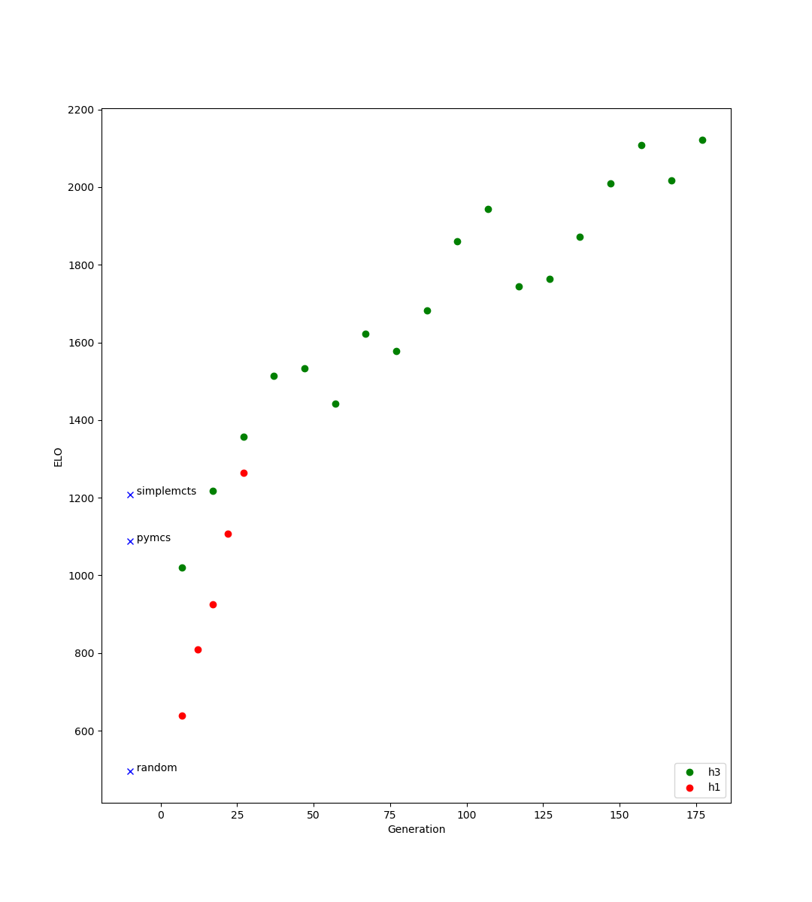

Amazons
=======

Models here:

* h1 - on of the first ganes gzero trained
* h3 - second attempt at training, for entering ICGA Computer Olympiad

Special thanks to Richard Lorentz for entertaining mini competitions to evaluate the strength of
models/bot on LG.

elo graph
---------
Each model has ran a minimum of 100 games with a randomised matching algorithm continuous tournament.  Each match is
configured with a small amount of noise, and 800 evaluations per move.

* The y-axis is ELO.
* The x-axis is somewhat arbitrary in terms of compute.  Each model produced has a numeric value, which goes up incrementally as training progresses.
* random player has a fixed ELO of 500.

both runs were with expert iteration.  No further training post ICGA 2018.

