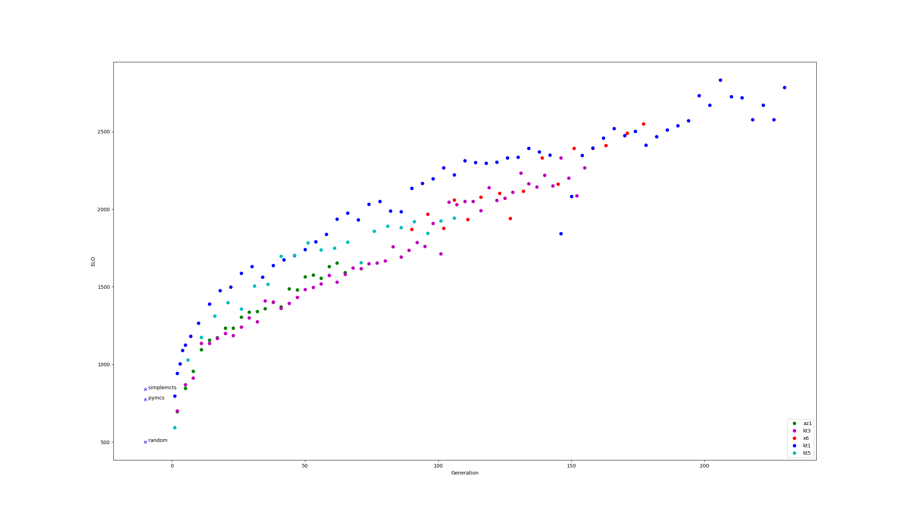

Breakthrough
============
v5_92 - was the first attempt at training breakthrough, over Xmas 2017 and early January 2018.  It
did not use multiple policies, but will run with commit
[5566375](https://github.com/ggplib/ggp-zero/commit/55663753ed479d449af80b1a7b93525bca5c9430).

The following models were ran on Little Golem:
All games before and include game #1929586 - x6_102
All games after #1929586 - x6_111

Trained at approx ggp-zero commit [5566375](https://github.com/ggplib/ggp-zero/commit/55663753ed479d449af80b1a7b93525bca5c9430).

Special thanks to Richard Lorentz & Fabien Letouzey for entertaining mini competitions to evaluate the strength of
models/bot on LG.

----

ICGA model: x6_164

experimental best model: kt1_206

elo graph
---------
Each model has ran a minimum of 100 games with a randomised matching algorithm continuous tournament.  Each match is
configured with a small amount of noise, and 800 evaluations per move.

* The y-axis is ELO.
* The x-axis is somewhat arbitrary in terms of compute.  Each model produced has a numeric value, which goes up incrementally as training progresses.
* The crosses are fixed players (ie no generation).   random player has a fixed ELO of 500.

X6 - run was performed in early 2018, and was expert iteration.

kt - runs are all full matches, no expert iteration.

kt1 - was hand tweaked config, with continuously upping the size of the network

kt3/kt5 - fixed config of ~200 evals per move (XXX need to check).  kt3 used oscillating move
generation (taking 20% of moves) - whereas kt5 is full matches (taking 100% of moves).  network was
enlarged during run.

az1 - configured with a very small network, and ran with maximum number evals so continuously
train (ran for about 20 hours on 3 gpus).

*Conclusion: quantity of data triumphs quality - as long train early & train often*

