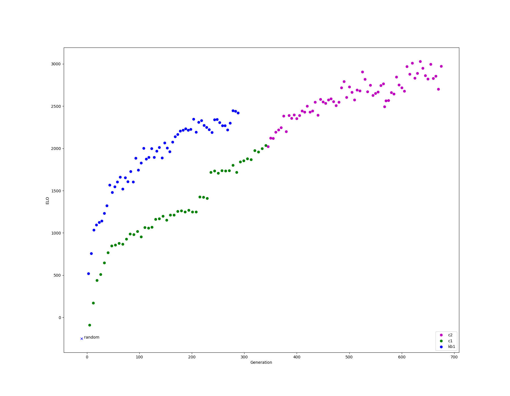

Chess
=====

* kb1 was trained with self play and historical data (concurrently 1-1 ratio).
* cb1/cb2 was trained via self play only.

elo graph
---------
Each model has ran a minimum of 100 games with a randomised matching algorithm continuous tournament.  Each match is
configured with a small amount of noise, and 800 evaluations per move.

* The y-axis is ELO.
* The x-axis is somewhat arbitrary in terms of compute.  Each model produced has a numeric value, which goes up incrementally as training progresses.
* random player has a fixed ELO of -250.

