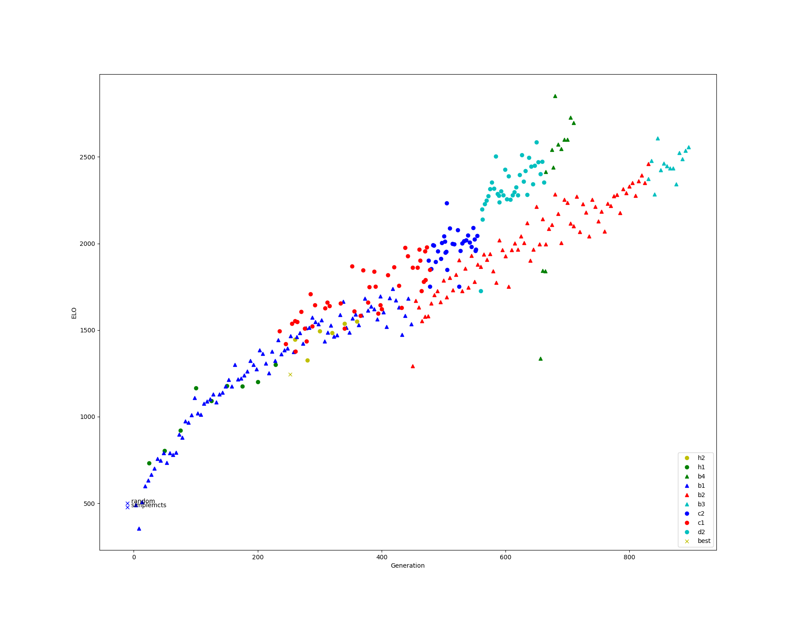

Hex 13
======

Models here:

* h1 - first attempt at training - ended @ 229 July, for first bot competition on LG
* h2_320 - model used in most games in championship Dec '18

* XXX still trying make sense of everything...

elo graph
---------
Each model has ran a minimum of 100 games with a randomised matching algorithm continuous tournament.  Each match is
configured with a small amount of noise, and 800 evaluations per move.

* The y-axis is ELO.
* The x-axis is somewhat arbitrary in terms of compute.  Each model produced has a numeric value, which goes up incrementally as training progresses.
* random player has a fixed ELO of 500.

